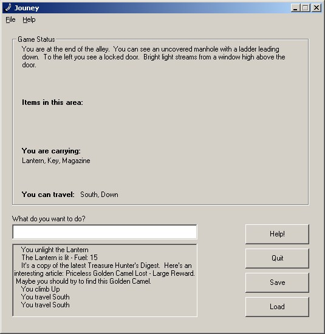

## Journey Text Game

### Description

I created this game based on an old game I used to play on my TI 99/4a Home Computer called Adventure. I created it with as much flexibility as possible to allow me to easily create additional game files. It is text based, and runs based on basic commands such as 'read', 'look', 'get', etc.
 
### More Info
 

             |
---                |---
**Submitted On**   |2003-01-23 13:14:22
**By**             |[Jason Allen](https://github.com/Planet-Source-Code/PSCIndex/blob/master/ByAuthor/jason-allen.md)
**Level**          |Intermediate
**User Rating**    |5.0 (15 globes from 3 users)
**Compatibility**  |VB 6\.0
**Category**       |[Games](https://github.com/Planet-Source-Code/PSCIndex/blob/master/ByCategory/games__1-38.md)
**World**          |[Visual Basic](https://github.com/Planet-Source-Code/PSCIndex/blob/master/ByWorld/visual-basic.md)
**Archive File**   |[Journey\_Te153889232003\.zip](https://github.com/Planet-Source-Code/jason-allen-journey-text-game__1-42929/archive/master.zip)

